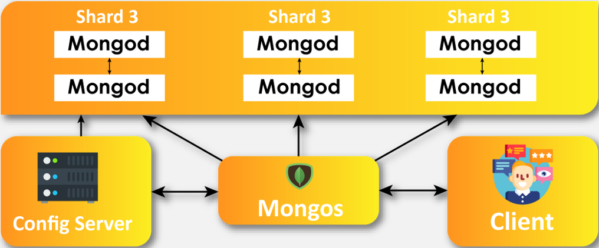

# What is MongoDB?

MongoDB is a popular document-oriented NoSQL database that allows for the creation, retrieval, 
and manipulation of data using a flexible and dynamic document-based model. 

MongoDB provides a wide variety of features, including a powerful query language, indexes for efficient data retrieval, 
aggregation framework for data analysis, and geospatial indexing for location-based queries. 
It is commonly used in web and mobile applications, content management systems, and big data solutions.

It was developed by MongoDB Inc. and is available as both an open-source and commercial product.

#
# What are NoSQL databases and how do they differ from SQL?

NoSQL (Not Only SQL) databases are a type of non-relational database that store and retrieve data using non-tabular models. 
In contrast to traditional SQL databases, which use a relational data model with tables, columns, and rows, NoSQL databases 
use various models such as document, key-value, graph, and column-family to store and organize data.

One of the key differences between NoSQL and SQL databases is the schema. SQL databases have a predefined schema that 
dictates the structure and data types of each table, while NoSQL databases have a flexible schema that allows for dynamic 
and evolving data models. This makes NoSQL databases more suitable for applications that require frequent schema changes 
or deal with unstructured or semi-structured data.

# Why is MongoDB popular?

MongoDB is popular for many reasons, some of the main reasons include:

- The document-based data model: Allows for the storage of complex and hierarchical data structures in a more natural 
and intuitive way compared to traditional SQL databases. This model also enables faster and more efficient data retrieval and manipulation

- Horizontal scaling through sharding and replication: Allows for seamless distribution of data across multiple nodes and ensures high 
availability and fault tolerance.

- A rich set of features including: A powerful query language, indexes for efficient data retrieval, aggregation framework for data analysis, and 
geospatial indexing for location-based queries. These features make it suitable for a wide range of applications, from web and mobile 
applications to content management systems and big data solutions.

# Mongo architecture diagram:



#
# What is the history of MongoDB?

The history of MongoDB dates back to 2007, when Dwight Merriman and Eliot Horowitz, co-founders of DoubleClick (acquired by Google), 
started working on a scalable, high-performance, and flexible database system to power their new web application platform, called ShopWiki. 
They were dissatisfied with existing relational database technologies and wanted to create a new type of database that could handle the 
growing complexity and scale of modern web applications.

After several iterations and refinements, they released the first version of MongoDB in 2009 as an open-source project under the Apache license. 
MongoDB quickly gained popularity among developers and businesses, and in 2013, the company MongoDB Inc. was founded to provide commercial 
support and services for the database. Since then, MongoDB has continued to evolve and grow, with a thriving community of users and contributors 
and a wide range of use cases across various industries.

#
# What is seeding in MongoDB? why do the databases need to be seeded?

In MongoDB, seeding refers to the process of populating a database with initial or test data. This is typically done at the beginning of a 
project or when creating a new instance of a database. Seeding can be done manually or automatically using scripts or tools.

seeding is an important process for ensuring the reliability, efficiency, and functionality of a MongoDB database, and is a common practice 
in database management and development.

#
# What port does mongodb use?

By default, MongoDB uses port number 27017 for client connections to the database server. However, MongoDB also supports multiple port 
numbers and can be configured to use a different port number if needed.

#
# Wow do you connect to a mongo database?

To connect to a MongoDB database, you need to follow these general steps:

1. Install the MongoDB database server on your machine or connect to a remote MongoDB server.

2. Install a MongoDB driver for your programming language of choice. MongoDB offers official drivers for many popular programming languages, including Python, Java, Node.js, Ruby, and C#.

3. Create a new connection object or URI string in your code that specifies the hostname, port, database name, and any authentication credentials required to connect to the database.

4. Use the connection object or URI string to connect to the database using the appropriate method provided by the MongoDB driver for your programming language.

5. Once connected, you can perform operations on the database, such as querying data, inserting or updating documents, or creating indexes.

Here's an example of how to connect to a MongoDB database using the Python driver:

```
import pymongo

# create a connection object
client = pymongo.MongoClient("mongodb://localhost:27017/")

# specify the database name
db = client["mydatabase"]

# authenticate if necessary
# client["mydatabase"].authenticate("myusername", "mypassword")

# perform operations on the database
collection = db["mycollection"]
result = collection.find_one({"name": "Jake"})
print(result)
```

This code connects to a MongoDB server running on the local machine on the default port 27017, specifies the name of the database to use ("mydatabase"), and retrieves a 
single document from a collection named "mycollection" that has a "name" field with the value "Jake".

#
# How to connect your app VM to your database VM:

- Once both VM's are launched with `vagrant up` and are finished loading:

1. In the db VM, use `sudo nano /etc/mongod.conf` to edit the mongod.conf file
2. Inside the file, under 'network interfaces' change the ip to `0.0.0.0` - it should look like the following:
```
# network interfaces
net:
  port: 27017
  bindIp: 0.0.0.0
```
3. CTRL + X, press y and then enter to save the file
4. Now enter `sudo systemctl restart mongod` to restart mongodb
5. Enter `sudo systemctl enable mongod` to re-enable mongodb
6. Now in the app VM we need to add a variable to the .bashrc file. Use `sudo nano .bashrc` to edit the file. 
7. Go to the bottom of the file and add the variable `export DB_HOST=mongodb://192.168.10.150:27017/posts` - this provides the connection ip information
8. Save the file and enter `source .bashrc` to reload the file
9. Use `printenv DB_HOST` to check the connection
10. Enter `cd app` to go into the app folder and then use `node seeds/seed.js` to seed the database
11. Put the address into your browser to check it's worked - `http://192.168.10.100:3000/posts` - you should recieve the posts page of the app
